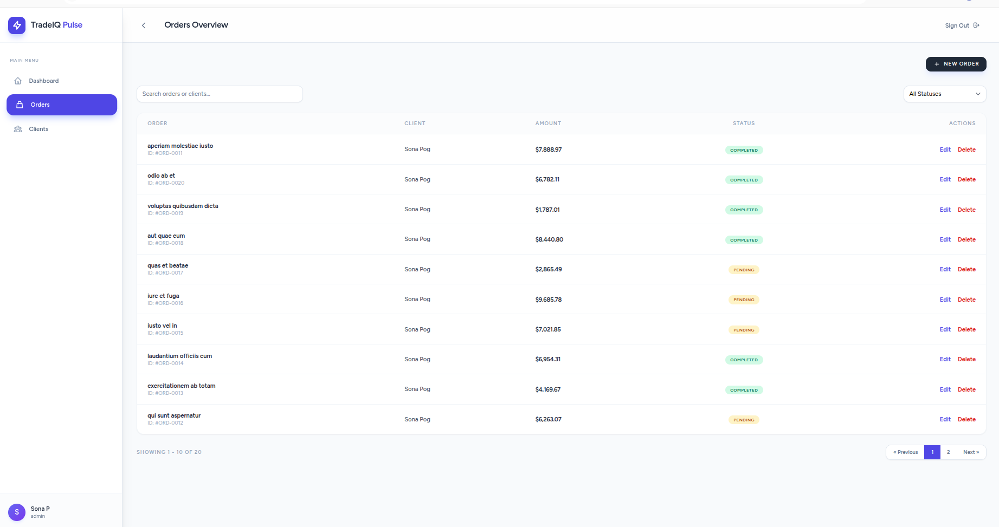

# SaaS Admin Dashboard (Laravel + Vue 3) 🚀

[](https://laravel.com)
[](https://vuejs.org)
[](https://tailwindcss.com)
[](https://www.docker.com)

A modern, full-stack admin panel designed with production-style SaaS and CRM architecture. This portfolio project demonstrates the seamless integration of a Laravel REST API with a reactive Vue 3 frontend, providing a high-performance experience for managing business operations.

---

## 📖 Overview

This dashboard serves as a central hub for managing users, clients, and orders. It is built with scalability in mind, utilizing an API-first approach and modern design patterns. The project emphasizes clean code, efficient database relationships, and a premium user interface.

## ✨ Features

- **🔐 Robust Authentication**: Secure login, registration, and comprehensive profile management (password updates, account deletion).
- **🛡️ RBAC (Role-Based Access Control)**: Granular permissions system with distinct Admin and User roles.
- **👥 Client Management**: Full CRUD operations for clients with advanced status tracking.
- **📦 Order Tracking**: Manage transactions with a relational system (Clients → Orders) and financial auditing.
- **📊 Business Intelligence**: Real-time dashboard statistics and activity metrics.
- **🔍 Advanced UI**: Server-side pagination, debounced global search, and semantic status filters.
- **⚡ Performance First**: Integrated modern skeleton loading UI to eliminate layout shift (CLS).
- **📱 Responsive Design**: Fully adaptive layout built with Tailwind CSS.

## 🛠 Tech Stack

| Layer          | Technology                          |
| -------------- | ----------------------------------- |
| **Backend**    | Laravel 11 (PHP 8.2+)               |
| **Frontend**   | Vue 3 (Composition API)             |
| **Styling**    | Tailwind CSS                        |
| **Database**   | MySQL 8.0                           |
| **DevOps**     | Docker, Docker Compose              |
| **Build Tool** | Vite                                |
| **Integrations** | Inertia.js (SPA Experience)         |

## 🏗 Architecture

The project follows an **Inertia-driven SPA** architecture, allowing for the development of a single-page application without the complexity of a separate API-only backend and frontend repository.

- **Models**: Efficient Eloquent relationships (e.g., `Client hasMany Order`).
- **Controllers**: Clean controllers leveraging Form Requests for validation and Resources for API responses.
- **Middleware**: Custom role-based middleware for secure route access.
- **Frontend Components**: Reusable, atomic Vue components styled with a custom design system.

## 📸 Screenshots

### 📋 Dashboard Overview  ### 📋 Orders Overview  ### 📋 Clients Overview 

| Dashboard Overview | Client Management |
| :---: | :---: |
|  |  |

## 📥 Installation

Ensure you have [Docker](https://www.docker.com/) and [Docker Compose](https://docs.docker.com/compose/) installed.

1. **Clone the repository**:
   ```bash
   git clone https://github.com/yourusername/saas-admin-dashboard.git
   cd saas-admin-dashboard
   ```

2. **Initialize Environment**:
   ```bash
   cp backend/.env.example backend/.env
   ```

3. **Spin up the Environment**:
   ```bash
   docker-compose up -d --build
   ```

4. **Install Dependencies & Setup**:
   ```bash
   # Backend dependencies
   docker exec admin_panel_app composer install
   
   # Frontend dependencies
   docker exec admin_panel_app npm install
   
   # Setup Application
   docker exec admin_panel_app php artisan key:generate
   docker exec admin_panel_app php artisan migrate --seed
   docker exec admin_panel_app npm run build
   ```

The application will be available at [http://localhost:7000](http://localhost:7000).

## 📡 API Overview

| Endpoint | Method | Description |
| --- | --- | --- |
| `/api/dashboard` | `GET` | Fetch aggregated dashboard statistics |
| `/api/clients` | `GET` | List clients with search and filters |
| `/api/clients` | `POST` | Create a new client |
| `/api/orders` | `GET` | List all relational orders |
| `/api/orders` | `POST` | Create a new order for a specific client |

## 🎯 Purpose of the Project

This project was built to demonstrate proficiency in:
- Designing complex **relational database schemas**.
- Implementing **secure authentication** and role-based authorization.
- Managing **asynchronous data fetching** in a reactive frontend.
- Deploying applications in **containerized environments** (Docker).
- Creating **premium UI/UX** following modern design principles.

## 🔮 Future Enhancements

- [ ] Interactive charting for financial analytics.
- [ ] Exportable data reports (PDF/CSV).
- [ ] Activity log for administrative auditing.
- [ ] Real-time updates via WebSockets.

---

Built with ❤️ for professional portfolio purposes.